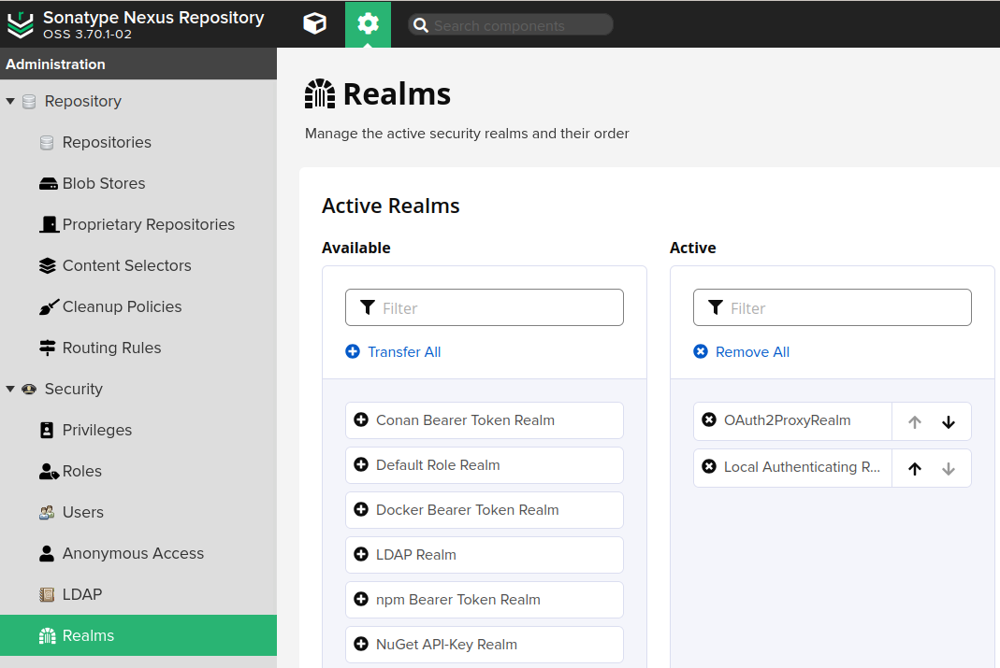

# OpenID Connect for Sonatype Nexus Artifact Repository

This plugin has been developed to facilitate the integration of Nexus with any identity provider that is compatible with [OAuth2 Proxy](https://github.com/oauth2-proxy/oauth2-proxy).

Rather than executing its own OIDC (OpenID Connect) authentication flow, this plugin leverages OAuth2 Proxy to undertake the authentication process, relying on it to provide the necessary information through headers.

Furthermore, acknowledging the importance of non-interactive programmatic access within the Nexus environment, this plugin incorporates an API token feature. The plugin introduces an additional endpoint that allows authenticated users to reset their own API token to a system-generated one via the Nexus UI, with the caveat that this token is displayed solely once and is subject to reset with each access of this user menu item.

## ⚠️ Disclaimer

It is important to highlight that this plugin is provided on an 'as-is' basis, without any form of express or implied warranty. Under no circumstances shall the authors be held accountable for any damages or liabilities arising from the utilization of this plugin. Users are advised to proceed at their own risk.

## Features

* makes use of several headers sent by OAuth2 proxy (depending on its configuration)
  * see constants in [OAuth2ProxyHeaderAuthTokenFactory](src/main/java/com/github/tumbl3w33d/OAuth2ProxyHeaderAuthTokenFactory.java)
  * creates an AuthenticationToken used by Nexus
* creates a user in a dedicated database table (i.e., not where Nexus checks for 'Local' users) if none with the given id (`preferred_username`) exists
  * anyone authenticated with your identity provider can access Nexus
  * you would control access by granting necessary scopes accessing OAuth2 Proxy only to eligible user groups
  * user creation currently has a rather simplistic strategy to extract `<firstname>.<lastname>` from `preferred_username`
* group/scope to role sync
  * if you configure OAuth2 Proxy with the well-known `groups` claim, it will retrieve that information from the identity provider
  * the groups received in the related header will be stored in a dedicated database table and become available for the 'external role mapping' functionality
* automatic expiry of API tokens
  * there is a configurable task that lets API tokens expire, so another login by the user is necessary to renew it
  * as long as the user keeps showing up regularly, their token will not expire

**Note**: After authenticating with this realm, the logout button is non-operative, which is a common limitation with header-based authentication methods. To force a logout, you need to logout from your identity provider and/or delete the OAuth2 Proxy cookie if you must logout for some reason.

## Supported Nexus version

This plugin moves along with the latest OSS version of Nexus.

When they introduce breaking changes, like the change of underlying database with version 3.71.0, this results in a new major version of this plugin being released when adjustments have been made. You are free to use older versions but they will probably not receive maintenance, unless you contribute it yourself. In addition, as long as the user base is small and quiet, there will not be much effort invested in adding complex migration logic. Since this plugin is mostly developed for internal use (so far), an appropriate solution for that use case will be found and that might mean dropping existing data (which basically means persisted API tokens) and start over in order keep things simple.

## Installation

The recommended way to install the plugin is by dropping the `.kar` into the Nexus `/deploy` folder, as described [here](https://sonatype-nexus-community.github.io/nexus-development-guides/plugin-install.html#more-permanent-install).

Once Nexus picked it up, it will offer you to activate the new realm this plugin comes with:



You can see the `OAuth2ProxyRealm` activated and first in the list, so it takes effect first in the authentication chain.

Now you should be able to access the Nexus via your OAuth2 Proxy and end up logged in. If you encounter strange behavior during this activation phase, it is easiest to test with a private browser window to rule out cached cookies or basic authentication can interfere.

Users that logged in using this realm will now appear in the Nexus administration section under `Security -> Users -> Source: OAuth2Proxy`.

You also want to visit `System -> Tasks` where you will find a new task for invalidating API tokens for users who did not show up for a while. While it has a default of 30d defined in the code, it appeared that it does not take effect until once set and saved via UI, so make sure you set an appropriate value there.

## Necessary infrastructure

You typically put an OAuth2 Proxy in front of your application and make sure that related `X-Forwarded-` headers do not reach the application other than those originating from the OAuth2 Proxy.

For non-interactive programmatic access you circumvent the OAuth2 Proxy and go straight to the Nexus application. To achieve that, you could check for the presence of an `Authorization: Basic` header earlier in the chain of proxies. In that case the required credentials are the user's id and the generated API token.

## Example with HAProxy as entrypoint

```
# the entrypoint to your nexus + oauth2 proxy setup
frontend you-name-it
  # just illustrating that you must ensure TLS
  bind *:443 ssl crt /usr/local/etc/haproxy/cert alpn h2,http/1.1

  # if this is too invasive for your use case, be more specific
  http-request del-header ^X-Forwarded.*

  # use case: artifact download from /repository via UI
  use_backend be_oauth2-proxy if { req.cook(_oauth2_proxy) -m found }

  # use case: programmatic access, circumvent oauth2 proxy
  acl is_basic_auth hdr_beg(Authorization) -i basic
  acl is_repo_req path_beg /repository/
  use_backend be_nexus if is_basic_auth OR is_repo_req

  # use case: interactive access via browser
  default_backend oauth2-proxy


backend oauth2-proxy
  # interactive OIDC login
  option httpchk GET /ping
  server oauth2-proxy oauth2-proxy:4180 check


backend nexus
  # non-interactive programmatic access
  server nexus nexus:8081 check
```

## Example OAuth2 Proxy config

```
reverse_proxy = true

http_address = "0.0.0.0:4180"

email_domains = [ "*" ]

# make sure to request group information for mapping to roles
scope = "openid email profile groups"

# your nexus is the backend
upstreams = ["http://nexus:8081"]

provider = "oidc"
oidc_issuer_url = "https://idm.example.com/consult/your/idp-documentation"
code_challenge_method = "S256" # PKCE, if your idp supports that
client_id = "get the client id from your identity provider"
client_secret = "get the secret from your identity provider"
cookie_secret = "generate an individual cookie secret"

# we don't need to wait for people to press the button, just redirect
skip_provider_button = true
```

**Note**: Depending on the amount of data the OAuth2 Proxy receives from your IDP (especially list of groups) you might want to look into [changing its session storage to redis/valkey](https://oauth2-proxy.github.io/oauth2-proxy/configuration/session_storage/#redis-storage). The proxy will warn you about data exceeding limits which results in multiple cookies being set for the proxy session.

## Troubleshooting

If you encounter authentication issues, you can activate logging for the plugin classes by creating a logger in the Nexus administration section (`Support -> Logging -> Create Logger`), e.g. for the top level package `com.github.tumbl3w33d`.